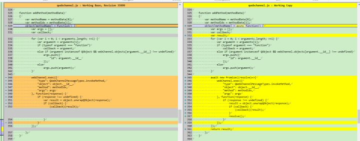

- [前言](#前言)
- [简介](#简介)
- [Qt与Web嵌套](#qt与web嵌套)
  - [MiniBrowser](#minibrowser)
  - [半透明测试](#半透明测试)
  - [渲染原理](#渲染原理)
  - [小结](#小结)
- [Qt与Web分离](#qt与web分离)
  - [Qt小车](#qt小车)
    - [原版小车](#原版小车)
    - [改进小车](#改进小车)
  - [必要的知识](#必要的知识)
    - [WebSocket和 QWebSocket](#websocket和-qwebsocket)
    - [WebChannel](#webchannel)
    - [Qt启动系统浏览器](#qt启动系统浏览器)
      - [Qt的OpenUrl](#qt的openurl)
      - [C# .net的 Process::Start](#c-net的-processstart)
  - [Web控制端](#web控制端)
    - [目录结构](#目录结构)
    - [Html](#html)
    - [TypeScript](#typescript)
      - [TypeScript中的QObject](#typescript中的qobject)
      - [TypeScript中连接websocket](#typescript中连接websocket)
      - [TypeScript中的QWebChannel](#typescript中的qwebchannel)
        - [TypeScript中使用javaScript](#typescript中使用javascript)
    - [改进qwebchannel.js以支持await](#改进qwebchanneljs以支持await)
    - [QObject to Typescript](#qobject-to-typescript)

# 前言


这次讨论Qt与Web混合开发相关技术。

这类技术存在适用场景，例如：Qt项目使用Web大量现成的组件/方案做功能扩展，

Qt项目中性能无关/频繁更新迭代的页面用html单独实现，Qt项目提供Web形式的SDK给

用户做二次开发等等，或者是Web开发人员齐全而Qt/C++人手不足，此类非技术问题，

都可以使用Qt + Web混合开发。

(不适用的请忽略本文)

# 简介

上次的文章《Qt与Web混合开发》，讨论了Qt与Web混合开发相关技术。

这次通过一个web控制小车的案例，继续讨论相关技术。

本文会先介绍Qt与Web嵌套使用,再介绍Qt与Web分开使用，之后着重讨论分开使用

的一些实现细节，特别是WebChannel通信、WebChannel在Web/typescript中的使用。

# Qt与Web嵌套

## MiniBrowser

这里以Qt官方的例子MiniBrowser来说明吧。

打开方式如下：


运行效果如下：


这个例子是在Qml中嵌套了WebView。

## 半透明测试

涛哥做了一个简单的半透明测试。

增加了两个半透明的小方块，蓝色的在WebView上面，红色的在WebView下面。

运行效果也是正确的:


代码是这样的：


红色框中是我增加的代码。

为什么要做半透明测试呢？根据以往的经验,不同渲染方式的两种窗口/组件嵌套在一起，总会出现透明失效之类的问题，例如 qml与Widget嵌套。

## 渲染原理

涛哥翻了一下Qt源码，了解到渲染的实现方式，Windows平台大致如下：

chromium在单独的进程处理html渲染，并将渲染结果存储在共享内存中；主窗口在需要重绘的时候，从共享内存中获取内容并渲染。

## 小结

这里的WebView内部封装好了WebEngine，其本身也是一个Item，就和普通的Qml一样，属性绑定、js function都可以正常使用，暂时不深入讨论了。

# Qt与Web分离

Qt与Web分离，就是字面意思，Web在单独的浏览器或者App中运行，不和Qt堆在一起。两者通过socket进行通信。

这里用我自己做的例子来说明吧。

先看看效果：


左边是Qt实现的一个简易小车，可以前进和转向。右边是Html5实现的控制端，控制左边的小车。

源码在github上: https://github.com/jaredtao/QtWeb

## Qt小车

### 原版小车

小车来自Qt的D-Bus Remote Controller 例子


原版的例子，实现了通过QDBus 跨进程 控制小车。

(吐槽：这是一个古老的例子,使用了GraphicsView 和QDBus)

(知识拓展1： DBus是unix系统特有的一种进程间通信机制，使用有些复杂。Qt对DBus机制进行了封装/简化，即QDBus模块，

通过xml文件的配置后，把DBus的使用转换成了信号-槽的形式。类似于现在的Qt Remote Objects)

(知识拓展2： Windows本身不支持DBus，网上有socket模拟DBus的方案。参考: https://www.freedesktop.org/wiki/Software/dbus/)

### 改进小车

我做了一些修改，主要如下：

* 去掉了DBus
* 增加控制按钮
* 增加WebChannel
* 修改Car的实现，导出一些属性和函数。
* 注册Car到WebChannel

这里贴一些关键代码

Car的头文件：


其中要说明的是：

  speed和angle属性具备  读、写、change信号。

  还有加速、减速、左转、右转四个公开的槽函数。

## 必要的知识

### WebSocket和 QWebSocket

WebSocket 是 HTML5 开始提供的一种在单个 TCP 连接上进行全双工通讯的协议。

WebSocket 使得客户端和服务器之间的数据交换变得更加简单，允许服务端主动向客户端推送数据。在 WebSocket API 中，浏览器和服务器只需要完成一次握手，两者之间就直接可以创建持久性的连接，并进行双向数据传输。

Qt为我们封装好了WebSocket，即QWebSocket和QWebSocketServer，简单易用。

如果你了解socket编程，就看作TCP好了；如果不了解，请先去补充一下知识吧。

### WebChannel

按涛哥的理解，WebChannel是在socket上建立的一种通信协议，这个协议的作用是把QObject暴露给远端的HTML。

大致使用流程：
  
  1. Qt程序中，要暴露的QObject全部注册到WebChannel。
  2. Qt程序中，启动一个WebSocketServer，等待Html的连接。
  3. Html加载好qwebchannel.js文件, 然后去连接WebSocket。
  4. 连接建立以后，Qt程序中，由WebChannel接手这个WebSocket，按协议将QObject的各种“元数据”传输给远端Html。
  5. Html端，qwebchannel.js处理WebSocket收到的各种“元数据”，用js的Object 动态创建出对应的QObject。

  到这里两边算是做好了准备，可以互相调用了。

  Qt端QObject数据变化只要发出信号，就会由WebChannel自动通知Web端；
  
  Web端可以主动调用QObject的public的 invok函数、槽函数，以及读、写属性。

### Qt启动系统浏览器

在使用WebChannel的时候，Qt端建立了WebSocketServer，之后要把server的路径(例如：ws://127.0.0.1:12345)告诉Html。

一般就是在打开Html的时候带上Query参数，例如： F:\QtWeb\index.html?webChannelBaseUrl=ws://127.0.0.1:12345

#### Qt的OpenUrl

Qml中有 Qt.openUrlExternally, C++ 中有 QDesktopServices::openUrl，本质一样， 都可以打开一个本地的html网页。

其在Windows平台的底层实现是Win32 API。这里有个Win32 API的缺陷，传Query参数会被丢掉。

#### C# .net的 Process::Start

涛哥找到了替代的方案:

 .net framework / .net core有个启动进程的函数： System.Diagnostics.Process::Start, 可以调用浏览器并传query参数

```C#
  //C# 启动chrome
  System.Diagnostics.Process.Start('chrome', 'F:\QtWeb\index.html?webChannelBaseUrl=ws://127.0.0.1:12345');
  //C# 启动firefox
  System.Diagnostics.Process.Start('firefox', 'F:\QtWeb\index.html?webChannelBaseUrl=ws://127.0.0.1:12345');
  //C# 启动IE
  System.Diagnostics.Process.Start('IExplore', 'F:\QtWeb\index.html?webChannelBaseUrl=ws://127.0.0.1:12345');
```

Qt中直接写C#当然不太好，不过呢，Win7/Win10 系统都带有Powershell，而powershell依赖于.net framework, 我们可以调用powershell来间接使用.net framework。

所以有了下面的代码：

```C++
    ...
    QString psCmd = QString("powershell -noprofile -command \"[void][System.Diagnostics.Process]::Start('%1', '%2')\"").arg(browser).arg(url.toString());
    bool ok = QProcess::startDetached(psCmd);
    qWarning() << psCmd;
    if (!ok) {
        qWarning() << "failed";
    }
    ...
```

结果完美运行。

## Web控制端

### 目录结构

Web端就按照Web常规流程开发。

Web部分的源码也在前文提到的github仓库，子路径是QtWeb\WebChannelCar\Web

如下是Web部分的目录结构：


脚本用typescript，包管理用npm，打包用webpack，编辑器用vs code, 都中规中矩。

内容比较简单，暂时不需要前端框架，手(复)写(制)的html和css。

### Html

html部分比较简单

```html
//index.html
<!DOCTYPE html>
<html>
<head>
    <meta http-equiv="Content-Type" content="text/html; chartset=utf-8" />
    <link rel="stylesheet" type="text/css" href="../style/style.css" />
    <link rel="stylesheet" type="text/css" href="../style/layout.css" />
</head>

<body>
    <button id="up" class="green button">加速</button>
    <button id="down" class="red button">减速</button>
    <button id="left" class="blue button">左转</button>
    <button id="right" class="blue button">右转</button>
    
    <div>
        <div>
            <label>速度: </label>
            <label id="speed">0</label>
        </div>
        <div>
            <label>角度: </label>
            <label id="angle">0</label>
        </div>
    </div>
</body>
<script src="../out/main.js">

</script>

</html>
```

样式和布局全靠css,这里就不贴了。

### TypeScript

脚本部分需要细说了。

src文件夹为全部脚本，目录结构如下：


#### TypeScript中的QObject

从main开始, 加点注释：

```ts
//main.ts
import WebChannelCore from "./webchannelCore";
//window加载时回调，入口
window.onload = () => {
    //初始化WebChannel，传参为两个回调，分别对应WebChannel建立连接和连接断开。
    WebChannelCore.initialize(onInit, onUninit);
}
//WebChannel建立连接的处理
function onInit() {
    //换图标
    (window as any).document.getElementById("img").src = "../img/connected.svg";
    //获取QObject对象
    let car = WebChannelCore.SDK.car;
    
    //取dom树上的组件

    let upBtn = (window as any).document.getElementById("up");
    let downBtn = (window as any).document.getElementById("down");
    let leftBtn = (window as any).document.getElementById("left");
    let rightBtn = (window as any).document.getElementById("right");

    let speedLabel = (window as any).document.getElementById("speed");
    let angleLabel = (window as any).document.getElementById("angle");
    //绑定按钮点击事件
    upBtn.onclick = () => {
        //调用QObject的接口
        car.accelerate();
    }
    downBtn.onclick = () => {
        car.decelerate();
    }
    leftBtn.onclick = () => {
        car.turnLeft();
    }
    rightBtn.onclick = () => {
        car.turnRight();
    }
    //QObject的信号连接到js 回调
    car.speedChanged.connect(onSpeedChanged);
    car.angleChanged.connect(onAngleChanged);
}
//WebChannel断开连接的处理
function onUninit() {
    //换图标
    (window as any).document.getElementById("img").src = "../img/disconnected.svg";
}
//异步更新 speed
async function onSpeedChanged() {
    let speedLabel = (window as any).document.getElementById("speed");
    let car = WebChannelCore.SDK.car;
    //获取speed，异步等待。
    //注意这里改造过qwebchannel.js，才能使用await。
    speedLabel.textContent = await car.getSpeed();
}
//异步更新 angle
async function onAngleChanged() {
    let angleLabel = (window as any).document.getElementById("angle");
    let car = WebChannelCore.SDK.car;
    //获取angle，异步等待。
    //注意这里改造过qwebchannel.js，才能使用await。
    angleLabel.textContent = await car.getAngle();
}

```

可以看到我们从WebChannelCore.SDK 中获取了一个car对象，之后就当作QObject来用了，包括调用它的函数、连接change信号、访问属性等。

这一切都得益于WebSocket/WebChannel.

#### TypeScript中连接websocket

接下来看一下WebChannelCore的实现

```ts
//WebChannelCore.ts
import { QWebChannel } from './qwebchannel';

type callback = () => void;
export default class WebChannelCore {
    public static SDK: any = undefined;
    private static connectedCb: callback;
    private static disconnectedCb: callback;
    private static socket: WebSocket;
    
    //初始化函数
    public static initialize(connectedCb: callback = () => { }, disconnectedCb: callback = () => { }) {
        if (WebChannelCore.SDK != undefined) {
            return;
        }
        //保存两个回调
        WebChannelCore.connectedCb = connectedCb;
        WebChannelCore.disconnectedCb = disconnectedCb;

        try {
            //调用link，并传入两个回调参数
            WebChannelCore.link(
                (socket) => {
                  //socket连接成功时，创建QWebChannel
                    QWebChannel(socket, (channel: any) => {
                        WebChannelCore.SDK = channel.objects;
                        WebChannelCore.connectedCb();
                    });
                }
                , (error) => {
                  //socket出错
                    console.log("socket error", error);
                    WebChannelCore.disconnectedCb();
                });
        } catch (error) {
            console.log("socket exception:", error);
            WebChannelCore.disconnectedCb();
            WebChannelCore.SDK = undefined;
        }
    }

    private static link(resolve: (socket: WebSocket) => void, reject: (error: Event | CloseEvent) => void) {
        //获取Query参数中的websocket地址
        let baseUrl = "ws://localhost:12345";
        if (window.location.search != "") {
            baseUrl = (/[?&]webChannelBaseUrl=([A-Za-z0-9\-:/\.]+)/.exec(window.location.search)![1]);
        }
        console.log("Connectiong to WebSocket server at: ", baseUrl);
        
        //创建WebSocket
        let socket = new WebSocket(baseUrl);
        WebChannelCore.socket = socket;
        //WebSocket的事件处理
        socket.onopen = () => {
            resolve(socket);
        };
        socket.onerror = (error) => {
            reject(error);
        };
        socket.onclose = (error) => {
            reject(error);
        };
    }
}
(window as any).SDK = WebChannelCore.SDK;

```

这部分代码不复杂，主要是连接WebSocket，连接好之后创建一个QWebChannel。

#### TypeScript中的QWebChannel

观察仔细的同学会发现，src文件夹下面，没有叫‘qwebchannel.ts’的文件，而是‘qwebchannel.js’,和一个‘qwebchannel.d.ts’

这涉及到另一个话题：

##### TypeScript中使用javaScript

‘qwebchannel.js’是Qt官方提供的，在js中用足够了。

而我们这里是用TypeScript，按照TypeScript的规则，直接引入js是不行的，需要一个声明文件 xxx.d.ts

所以我们增加了一个qwebchannel.d.ts文件。 

（熟悉C/C++的同学，可以把d.ts看作typescript的头文件）

内容如下：
```typescript
//qwebchannel.d.ts
export declare function QWebChannel(transport: any, initCallback: Function): void;
```
只是导出了一个函数。

这个函数的实现在‘qwebchannel.js’中:

```javascript
//qwebchannel.js
"use strict";

var QWebChannelMessageTypes = {
    signal: 1,
    propertyUpdate: 2,
    init: 3,
    idle: 4,
    debug: 5,
    invokeMethod: 6,
    connectToSignal: 7,
    disconnectFromSignal: 8,
    setProperty: 9,
    response: 10,
};

var QWebChannel = function(transport, initCallback)
{
    if (typeof transport !== "object" || typeof transport.send !== "function") {
        console.error("The QWebChannel expects a transport object with a send function and onmessage callback property." +
                      " Given is: transport: " + typeof(transport) + ", transport.send: " + typeof(transport.send));
        return;
    }
    ...
}
function QObject(name, data, webChannel)
{
  ...
}
```
这个代码比较长，就不全部贴出来了。主要实现了两个类，QWebChannel和QObject。

QWebChannel就是用来接管websocket的，而QObject是用js Object模拟的 Qt的 QObject。

这一块不细说了，感兴趣的同学可以自己去研究源码。

### 改进qwebchannel.js以支持await

Qt默认的qwebchannel.js在实际使用过程中，有些不好的地方，就是函数的返回值不是直接返回，而是要在回调函数中获取。

比如car.getAngle要这样用：

```ts
    let angle = 0;
    car.getAngle((value:number)=> {
      angle = value;
    });
```

我们的实际项目中，有大量带返回值的api，这样的用法每次都嵌套一个回调函数，很不友好，容易造成回调地狱。

我们同事的解决方案是，在typescript中把这些api再用Promise封装一层，外面用await调用。

例如这样封装一层：

```ts
function getAngle () {
    return new Promise((resolve)=>{
        car.getAngle((value:number)=> {
            resolve(value);
        });
  });
}
```

使用和前面的代码一样：

```ts
//异步更新 angle
async function onAngleChanged() {
    let angleLabel = (window as any).document.getElementById("angle");
    let car = WebChannelCore.SDK.car;
    //获取angle，异步等待。
    //注意这里改造过qwebchannel.js，才能使用await。
    angleLabel.textContent = await car.getAngle();
}
```

这种解决方案规避了回调地狱，但是工作量增加了。

涛哥思考良久，稍微改造一下qwebchannel.js，自动把Promise加进去，也不需要再额外封装了。

改动如下：



### QObject to Typescript

我们在Qt 程序中写了QObject，然后暴露给了ts。

在ts这边，一般也需要提供一个声明文件，明确有哪些api可用。

例如我们的car声明：

```ts
//CarObject.ts
declare class Car {
    get speed():number;
    set speed(value:number);

    get angle():number;
    set angle(vlaue:number);

    public accelerate():void;
    public decelerate():void;
    public turnLeft():void;
    public turnRight():void;
}
```
这里涛哥写了一个小工具，能够解析Qt中的QObject，并生成对应的ts文件。

当然还是实验阶段，有兴趣的也可以关注一下

https://github.com/jaredtao/QObject2TypeScript